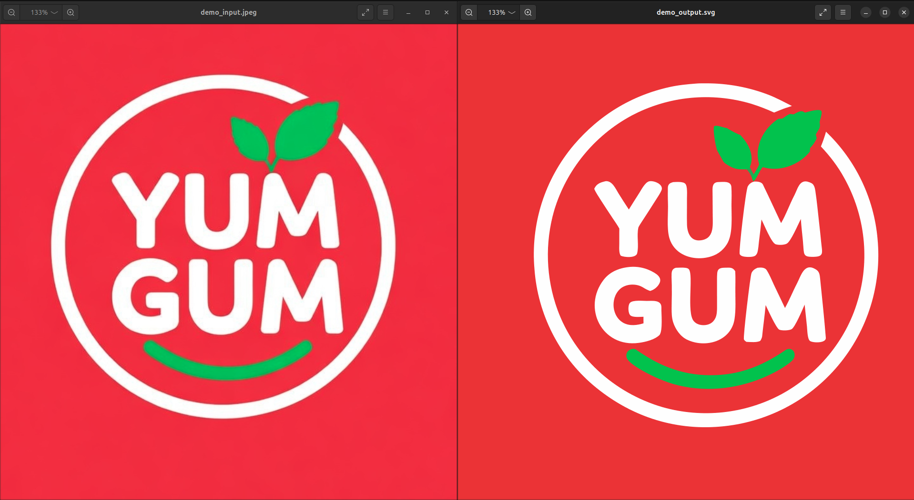
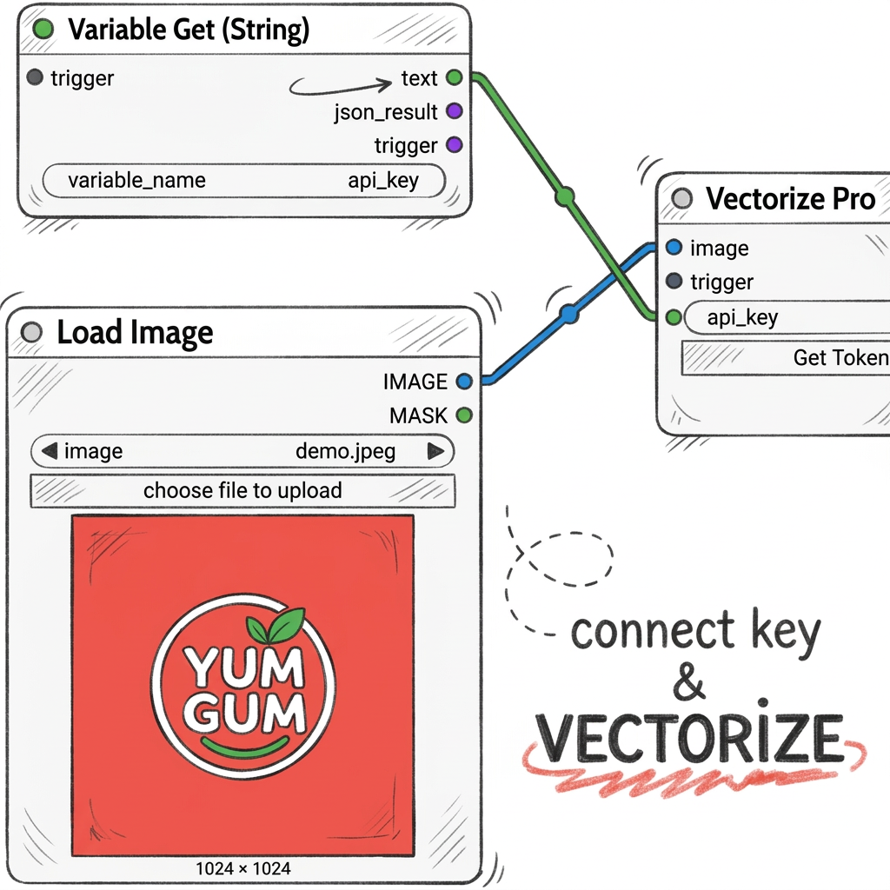

# Augment Vectorize Pro: PNG to SVG Vectorizer for ComfyUI

Convert raster images into clean, scalable vector graphics, right inside ComfyUI. Augment Vectorize Pro takes your PNGs (logos, icons, illustrations, brand marks) and returns production-ready SVG files with crisp edges, accurate colors, and none of the artifacts you get from auto-trace tools.

Built for designers, studios, and agencies that need vector output they can actually hand off to a client or send to print without cleanup.

## Why this exists

Most PNG-to-SVG converters produce noisy paths, stray anchor points, and muddy fills. Vectorize Pro is powered by the Augment Studio API and tuned specifically for **design assets**: flat artwork, logomarks, icons, and brand graphics. The result is a minimal, well-structured SVG you can open in Illustrator, Figma, or Affinity and use as-is.

## Results



## What you get

- **True vector output.** Real paths, not embedded rasters. Scale your logo to a billboard or shrink it to a favicon with zero quality loss.
- **Clean geometry.** Smooth curves, minimal anchor points, no stray fragments. The kind of SVG you'd actually put in a brand guidelines PDF.
- **Accurate color mapping.** Fills and strokes match your source artwork. Drop a logo in, get the exact brand colors back out.
- **Logo-ready files.** Output is structured for real design work: wordmarks, logomarks, icons, monograms, badges. Open it in Illustrator or Figma and it's ready to use.
- **Chainable workflows.** Includes Trigger and Wait nodes for wiring multi-step pipelines (upscale first, then vectorize, etc.).

## Getting started

1. Grab an API key at [augmentstudio.app/pricing](https://augmentstudio.app/pricing)
2. Install from ComfyUI Manager (search **"augment Vectorize Pro"**)
3. Add the **Vectorize Pro** node to your workflow, paste in your key, and connect an image

The node submits your image, polls for completion, and returns the SVG automatically. No extra steps.

### Storing your API key for reuse

Instead of pasting your key into every node, you can store it once using the **Variable Set** and **Variable Get** nodes from [augment-ComfyUI](https://github.com/augment-lib/augment-ComfyUI). Install that repo for the extra utility nodes, then:

1. Add a **Variable Set (String)** node. Set `variable_name` to `api_key` and paste your key into the `value` field.
2. Add a **Variable Get (String)** node. Set `variable_name` to `api_key` and connect its `text` output to the `api_key` input on **Vectorize Pro**.
3. Once set, you can use **Variable Get** in any workflow and it will always pull your saved key. No need to paste it again.



## Included nodes


| Node                                                  | Category          | Description                                                                                      |
| ----------------------------------------------------- | ----------------- | ------------------------------------------------------------------------------------------------ |
| **Vectorize Pro**                                     | Augment / Enhance | Converts a PNG image to a production-ready SVG via the Augment Studio API.                       |
| **Trigger**                                           | Augment / Utils   | Converts any input into a trigger signal for sequencing nodes.                                   |
| **Wait (Int, Float, String, Bool, Image, Latent, ...)** | Augment / Utils   | Holds a value until a trigger fires. Use these to enforce execution order in complex workflows. |


## Example workflow

```
Load Image > Vectorize Pro > Save SVG
```

Or chain it with [Augment Upscale Pro](https://github.com/augment-lib/upscale-pro) for maximum quality. Upscale your asset 2x first, then vectorize:

```
Load Image > Upscale Pro (2x) > Vectorize Pro > Save SVG
```

## Manual install

```bash
cd ComfyUI/custom_nodes
git clone https://github.com/augment-lib/vectorize-pro.git augment-vectorize-pro
```

Restart ComfyUI and the nodes will register automatically.

## Requirements

- ComfyUI (latest recommended)
- Python 3.10+
- An Augment Studio API key ([get one here](https://augmentstudio.app/pricing))

Dependencies (`numpy`, `Pillow`, `requests`, `torch`) are installed automatically by ComfyUI Manager or listed in `pyproject.toml` for manual installs.

## Who it's for

- **Brand designers** cleaning up logo assets for style guides
- **Agencies** converting client-supplied rasters into print-ready vectors
- **Icon designers** producing SVG icon sets from pixel art or AI-generated images
- **ComfyUI power users** building end-to-end asset pipelines that output scalable graphics

## License

MIT. See [LICENCE.md](LICENCE.MD) for details.